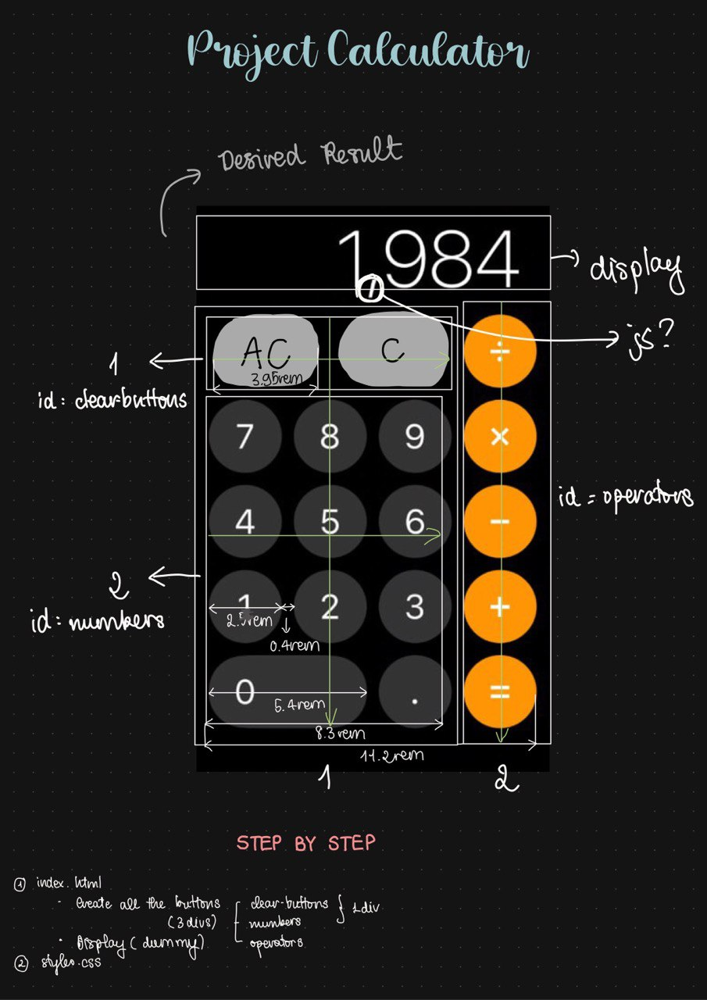
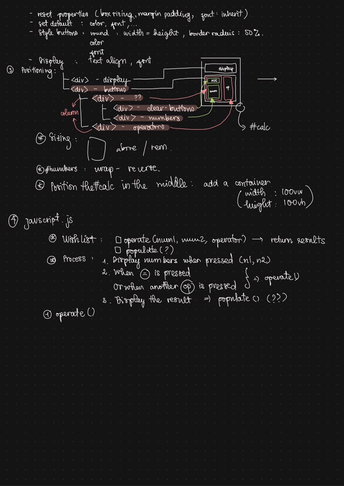

This is my 4th project for The Odin Project.
Live Preview: https://strandedorca.github.io/calculator/
# Timeline
### 21-03-2023
- Finish the structure (index.html).
- Finish styling (styles.css).
- Start writing the script.

- Initial Commit
- Problem: need to learn more about DOM manipulation and events.

### 29-03-2023
- Learned about DOM manipulation and events.
- All DOM nodes selected successfully.
- Finished all basic scripts.

### 30-02-2023 
- Solved the display problem I was stuck in yesterday for 3 hours (in 20min bruh).
- Added script to allow decimal points to be used only once.
- Added script to round floating point numbers.
- Added script for the clear everything button and the backspace button.
- Modify the behavior of the "0" button.
- Problems remained: overflow display & keyboard support
- Overflow display solved - but doesn't work with numbers that are too large.